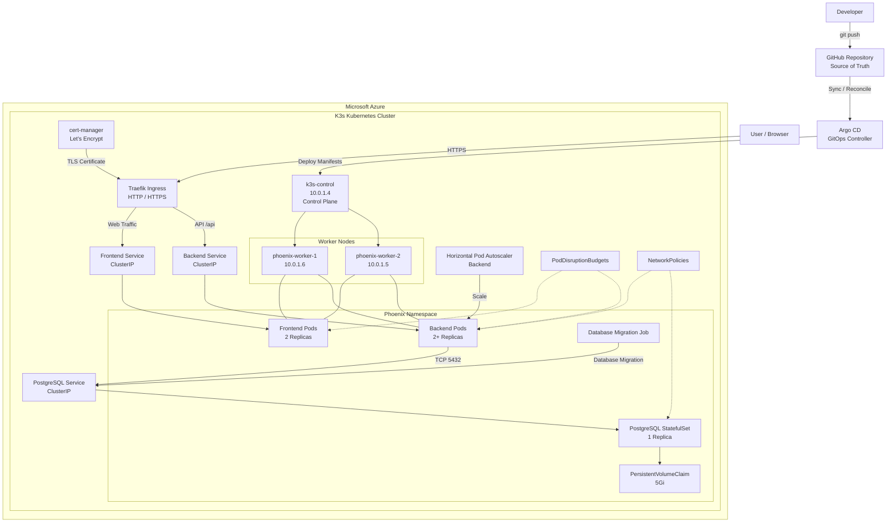

# Phoenix Capstone Architecture

## Overview

The Phoenix TaskApp is a containerized application deployed on a three-node K3s Kubernetes cluster running on Azure Virtual Machines.

The platform uses GitHub as the source of truth, Argo CD for GitOps continuous reconciliation, Traefik for ingress routing, cert-manager for TLS certificate management, Kubernetes NetworkPolicies for workload isolation, and persistent storage for PostgreSQL.

---

## Architecture Diagram



---

## 1. Infrastructure Layer

The Kubernetes cluster is hosted on Microsoft Azure Virtual Machines.

| Node | Private IP | Role |
|---|---|---|
| `k3s-control` | `10.0.1.4` | K3s Control Plane |
| `phoenix-worker-1` | `10.0.1.6` | Worker Node |
| `phoenix-worker-2` | `10.0.1.5` | Worker Node |

The three-node architecture provides workload distribution across multiple machines instead of running the application on a single node.

Terraform is used to provision and manage the Azure infrastructure.

---

## 2. GitOps Deployment Architecture

GitHub is the source of truth for the Kubernetes manifests.

```text
Developer
    |
    | git push
    v
GitHub
    |
    | repository changes
    v
Argo CD
    |
    | reconciliation
    v
K3s Cluster
    |
    +--> Frontend Deployment
    +--> Backend Deployment
    +--> PostgreSQL StatefulSet
    +--> Services
    +--> Ingress
    +--> NetworkPolicies
```

Argo CD continuously compares the desired state stored in GitHub with the state running inside Kubernetes.

The final deployment state is:

```text
Argo CD
  Sync Status:   Synced
  Health Status: Healthy
```

---

## 3. Application Request Flow

The public application is exposed through the nip.io hostname:

```text
https://taskapp.102.37.138.23.nip.io
```

Traffic follows this path:

```text
User / Browser
      |
      v
Public DNS / nip.io
      |
      v
Traefik Ingress
      |
      +----------------------+
      |                      |
      v                      v
Frontend Service       Backend Service
      |                      |
      v                      v
Frontend Pods          Backend Pods
                             |
                             | TCP 5432
                             v
                     PostgreSQL Service
                             |
                             v
                    PostgreSQL StatefulSet
                             |
                             v
                    PersistentVolumeClaim
                           5Gi
```

### Routing

| Request | Destination |
|---|---|
| `/` | Frontend Service |
| `/api` | Backend Service |

Traefik provides the external entry point into the Kubernetes application.

---

## 4. Frontend

The frontend application runs as a Kubernetes Deployment.

```text
Frontend Deployment
        |
        +---- Frontend Pod
        |
        +---- Frontend Pod
```

The frontend Service provides stable internal access to the frontend Pods.

Multiple replicas allow frontend traffic to be distributed across the available worker nodes.

---

## 5. Backend

The backend application runs as a Kubernetes Deployment.

```text
Backend Deployment
        |
        +---- Backend Pod
        |
        +---- Backend Pod
```

The backend is configured with a Horizontal Pod Autoscaler.

Current configuration:

```text
Minimum Replicas: 2
Maximum Replicas: 4
CPU Target:       70%
```

This allows Kubernetes to increase backend capacity when CPU utilization increases.

---

## 6. PostgreSQL Persistence

PostgreSQL runs as a Kubernetes StatefulSet.

```text
PostgreSQL StatefulSet
          |
          v
   PostgreSQL Pod
          |
          v
PersistentVolumeClaim
        5Gi
          |
          v
     local-path
```

The database uses persistent storage so that application data is not tied exclusively to the lifecycle of an individual PostgreSQL Pod.

The PostgreSQL Service provides stable internal connectivity for backend workloads.

---

## 7. Database Migration

Database migrations are handled through a Kubernetes Job:

```text
Phoenix Migration Job
          |
          | Database Migration
          v
PostgreSQL Service
          |
          v
PostgreSQL
```

The migration Job completed successfully during the deployment validation.

---

## 8. Ingress and TLS

Traefik provides the Kubernetes ingress layer.

```text
Internet
   |
   v
nip.io hostname
   |
   v
Traefik
   |
   +--> Frontend
   |
   +--> Backend API
```

TLS certificate management is handled by cert-manager.

```text
cert-manager
     |
     v
Let's Encrypt
     |
     v
TLS Certificate
     |
     v
Traefik
```

This provides HTTPS support for the public application endpoint.

---

## 9. Network Security

Kubernetes NetworkPolicies restrict communication between workloads.

The Phoenix namespace contains policies for:

```text
Frontend
   |
   v
Backend
   |
   v
PostgreSQL
```

The PostgreSQL workload is not exposed directly to the public internet.

Database traffic is restricted to approved internal workloads.

---

## 10. Resilience and Availability

The application includes several availability mechanisms:

- Three-node K3s cluster.
- Two frontend replicas.
- Two backend replicas.
- Backend Horizontal Pod Autoscaler.
- PodDisruptionBudgets for frontend and backend.
- PostgreSQL persistent storage.
- Kubernetes Services for stable service discovery.
- Argo CD continuous reconciliation.
- Multiple worker nodes for workload distribution.

The backend HPA is configured to scale between two and four replicas based on CPU utilization.

---

## 11. Observability

The Kubernetes environment includes Kubernetes Metrics Server, allowing resource utilization to be inspected through Kubernetes metrics.

Example:

```text
kubectl top pods -n phoenix
```

This provides CPU and memory visibility for application workloads.

---

## 12. Deployment Components

| Component | Technology | Purpose |
|---|---|---|
| Infrastructure | Terraform | Azure infrastructure provisioning |
| Container Orchestration | K3s | Kubernetes runtime |
| GitOps | Argo CD | Continuous reconciliation |
| Ingress | Traefik | HTTP/HTTPS routing |
| TLS | cert-manager + Let's Encrypt | Certificate management |
| Frontend | Kubernetes Deployment | Web application |
| Backend | Kubernetes Deployment | API application |
| Database | PostgreSQL StatefulSet | Persistent application data |
| Scaling | HPA | Backend autoscaling |
| Availability | PDB | Disruption protection |
| Security | NetworkPolicies | Workload isolation |
| Storage | PVC | Persistent PostgreSQL storage |
| Monitoring | Metrics Server | CPU and memory metrics |

---

## 13. Evidence

Deployment evidence is stored in:

```text
docs/EVIDENCE/
```

Evidence includes:

- Kubernetes node readiness.
- Workload distribution.
- PostgreSQL persistent storage.
- Services and Traefik ingress.
- HPA and PodDisruptionBudgets.
- NetworkPolicies.
- Database migration completion.
- Argo CD synchronization and health.
- Cluster resource metrics.

The live application demonstration is documented in the root README.

---

## 14. Live Application

The Phoenix TaskApp is available at:

**https://taskapp.102.37.138.23.nip.io**

A screenshot of the working live application is included in the root `README.md` as final deployment evidence.

---

## 15. Architecture Summary

The Phoenix Capstone combines cloud infrastructure, Kubernetes orchestration, GitOps, ingress management, TLS, persistent storage, autoscaling, network security, and observability into one production-style DevOps deployment.

The overall flow is:

```text
Developer
    |
    v
GitHub
    |
    v
Argo CD
    |
    v
K3s Cluster
    |
    +-----------------------------+
    |                             |
    v                             v
Traefik Ingress              Kubernetes Workloads
    |                             |
    |                     +-------+-------+
    |                     |               |
    v                     v               v
Frontend              Backend         PostgreSQL
Service               Service         StatefulSet
    |                     |               |
    v                     v               v
Frontend Pods        Backend Pods       PVC
```

This architecture provides a reproducible, scalable, persistent, secure, and GitOps-managed Kubernetes deployment for the Phoenix TaskApp.
